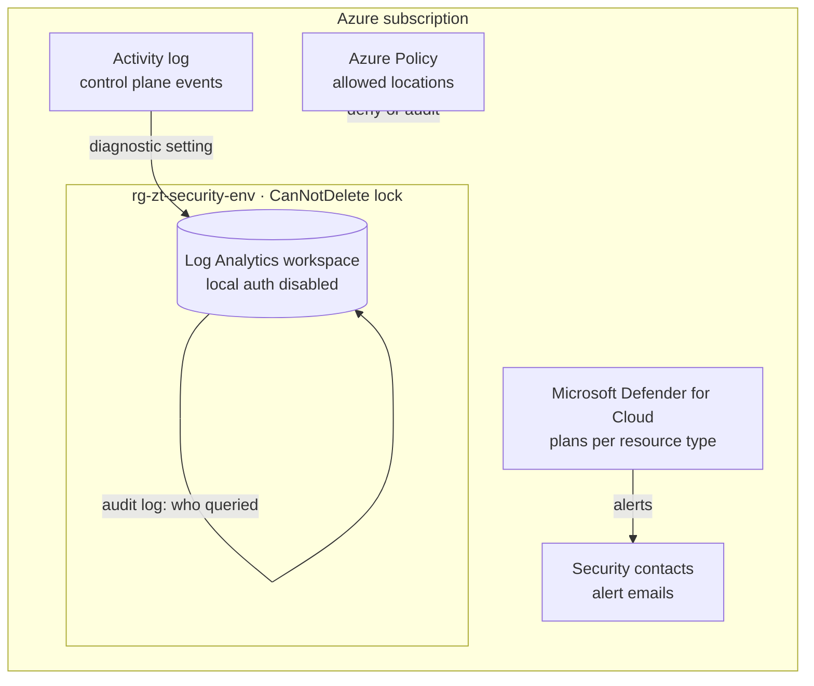

# Architecture

This template builds the security foundation of one Azure subscription. It is intentionally small: it creates the pieces every subscription needs before the first workload lands, and nothing that depends on a specific workload.

## Components

| Component | Module | What it does |
|---|---|---|
| Resource group | `main.bicep` | Holds the security workspace. Tagged with `environment`, `workload` and `managedBy`. |
| Log Analytics workspace | `modules/logAnalytics.bicep` | Central store for security logs. Retention 30-730 days, optional daily cap. |
| Workspace audit | `modules/logAnalytics.bicep` | Sends the workspace's own audit log (`LAQueryLogs`) to itself, so queries against security data are traceable. |
| Activity log export | `modules/activityLog.bicep` | Streams all activity log categories of the subscription into the workspace. |
| Defender for Cloud | `modules/defender.bicep` | Enables the selected plans with sub-plans, one at a time. |
| Security contacts | `modules/securityContacts.bicep` | Sends Defender alerts from the chosen severity upwards to a team mailbox and to subscription owners. |
| Guardrails | `modules/policy.bicep` | Assigns the built-in policies *Allowed locations* and *Allowed locations for resource groups*. |
| Delete lock | `modules/lock.bicep` | `CanNotDelete` lock on the security resource group. |

## Zero Trust mapping

| Principle | How this template supports it |
|---|---|
| **Verify explicitly** | The workspace accepts only Microsoft Entra ID authentication (`disableLocalAuth`), so shared keys cannot be used for ingestion or queries. Deployments authenticate with OIDC federation instead of stored secrets. |
| **Use least privilege** | Access to logs follows resource permissions (`enableLogAccessUsingOnlyResourcePermissions`). The deployment identity needs a defined set of roles, documented in [deployment.md](deployment.md). |
| **Assume breach** | Control plane events and Defender alerts land in one workspace that is protected by a delete lock, and every query against it is audited. Alerts reach a team mailbox, not a single person. |

## Design decisions

**One workspace per subscription and environment.** Simple to reason about and easy to connect to Microsoft Sentinel later. In a multi-subscription landing zone, point `workspaceId` of the activity log module to a central workspace instead.

**Local authentication disabled.** The legacy Log Analytics agent (MMA) used workspace keys and is retired. The Azure Monitor Agent and data collection rules authenticate with Entra ID, so there is no reason to keep shared keys enabled.

**Defender plans as a parameter.** Plans cost money per protected resource. The development parameter file enables two low-cost plans; production enables broad coverage. Always set the sub-plan for `KeyVaults` (`PerKeyVault`) and `Arm` (`PerSubscription`): the legacy per-transaction variants are deprecated and can no longer be onboarded. `Dns`, `KubernetesService` and `ContainerRegistry` are deprecated plan names; use `VirtualMachines` (P2) and `Containers` instead.

**Serial deployment of Defender plans.** Updating several pricings in parallel can fail with a conflict, so the module uses `@batchSize(1)`.

**Microsoft cloud security benchmark not assigned here.** Defender for Cloud assigns the benchmark initiative automatically when it is enabled. Assigning it again would create duplicate compliance results.

**Guardrails start in audit mode for dev.** `policyEnforcementMode = 'DoNotEnforce'` reports non-compliant regions without blocking experiments. Production uses `Default` and denies them.

**Delete lock.** The lock protects the workspace against accidental deletion, including by the pipeline itself. Remove it deliberately when you decommission the environment.

## Out of scope (for now)

- Microsoft Sentinel onboarding and analytics rules
- Azure Monitor Private Link Scope for private ingestion and query
- DeployIfNotExists policies that attach diagnostic settings to every resource
- Management group hierarchy and cross-subscription policy
